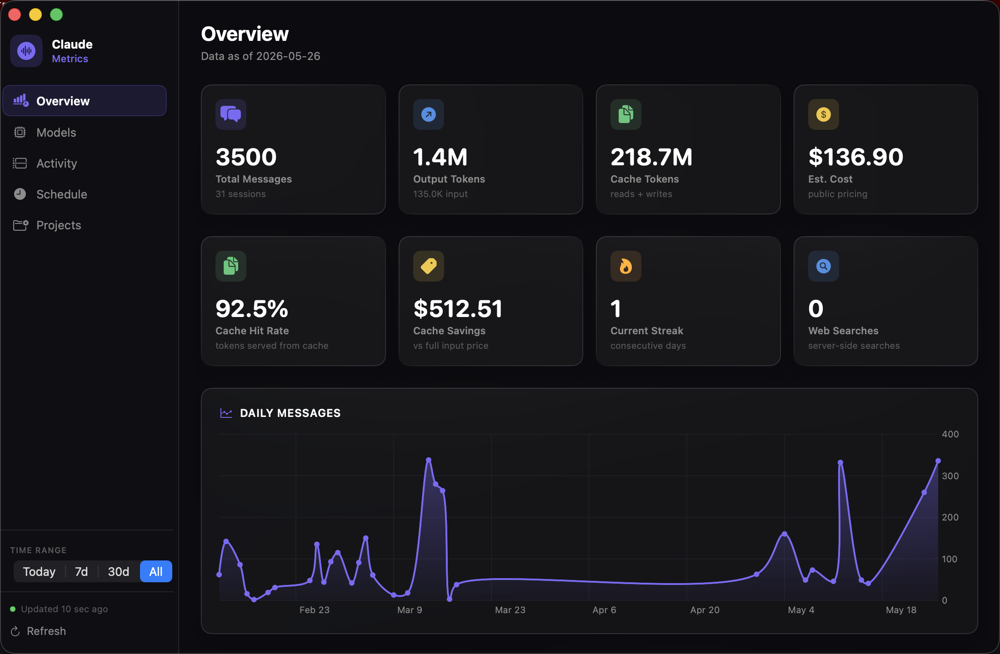

# ArgusAI

A native macOS app that monitors your [Claude Code](https://claude.ai/code) usage like a satellite — tokens, costs, projects, activity patterns — updated in real time.

> *Argus, the hundred-eyed giant of Greek mythology, never slept. He watched everything.*



---

## What it does

ArgusAI reads the local log files that Claude Code writes on your machine and turns them into a dashboard:

| Tab | What you see |
|---|---|
| **Overview** | Total messages, tokens, cost, cache hit rate, web searches, current streak |
| **Models** | Token breakdown and cost per model (Opus, Sonnet, Haiku) |
| **Activity** | Daily message chart, day-of-week heatmap, active streak |
| **Schedule** | Hourly usage distribution, your peak hour, average start/end time |
| **Projects** | Cost and token usage broken down by repository |

Everything updates automatically every 3 seconds. No API key needed. No account. No data leaves your machine.

---

## Requirements

- macOS 26 (Tahoe) or later
- Apple Silicon Mac (M1 or later)
- [Claude Code](https://claude.ai/code) installed and used at least once

---

## Install

1. Download the latest zip from the [Releases](../../releases) page
2. Unzip it
3. **Right-click** `ArgusAI.app` → **Open**
4. Click **Open** in the security dialog (macOS asks this only the first time for apps not from the App Store)

That's it. No installer, no setup.

---

## Build from source

If you want to build it yourself:

```bash
git clone <this-repo>
cd test-cocoa
bash build.sh
open ArgusAI.app
```

To create a distributable zip:

```bash
bash dist.sh
# → ArgusAI-1.0-YYYYMMDD.zip
```

**Requirements to build:** Xcode Command Line Tools (`xcode-select --install`)

---

## How it works

Claude Code writes a `.jsonl` log file for every conversation, stored at:

```
~/.claude/projects/**/*.jsonl
```

Every 3 seconds ArgusAI checks for new data and silently updates the dashboard. Under the hood it uses an embedded SQLite database (`~/.claude/argusai.db`) for fast incremental ingestion:

```
JSONL files → incremental ingest (new lines only) → SQLite → dashboard
```

On each refresh, only the lines added since the last run are read and inserted. All KPI queries run against indexed SQL tables, so the dashboard stays snappy even with hundreds of sessions.

ArgusAI looks at `assistant` messages and reads:

- `message.usage.input_tokens` / `output_tokens`
- `message.usage.cache_read_input_tokens` / `cache_creation_input_tokens`
- `message.usage.server_tool_use.web_search_requests`
- `message.model`
- `sessionId`, `timestamp`, `cwd` (to group by project)

Cost estimates use [Anthropic's public pricing](https://www.anthropic.com/pricing). They are estimates, not your actual bill.

### Ad-hoc queries

Because all data lives in SQLite, you can run your own queries any time:

```bash
sqlite3 ~/.claude/argusai.db
```

Useful tables: `messages`, `sessions`, `tool_events`. Example:

```sql
-- cost by project, last 30 days
SELECT project, ROUND(SUM(cost_usd),2) AS cost, COUNT(*) AS messages
FROM messages
WHERE day >= date('now', '-30 days')
GROUP BY project ORDER BY cost DESC;
```

---

## Privacy

**All data stays on your machine.** ArgusAI never connects to the internet. It only reads files in `~/.claude/projects/` that Claude Code already created.

---

## Date filters

Use the **TIME RANGE** picker in the sidebar to scope everything to:

- **Today** — current day only
- **7d** — last 7 days
- **30d** — last 30 days
- **All** — since you started using Claude Code

All tabs (Overview, Models, Activity, Schedule, Projects) update when you change the filter.

---

## Troubleshooting

**"ArgusAI can't be opened because it is from an unidentified developer"**
→ Right-click the app → Open → Open. You only need to do this once.

**The app shows no data**
→ Make sure you have used Claude Code at least once. Check that `~/.claude/projects/` exists and contains `.jsonl` files.

**Numbers look stale**
→ The app auto-refreshes every 3 seconds. If you just finished a session, wait a moment. You can also click **Refresh** in the sidebar.

**App won't launch on my Mac**
→ This build requires Apple Silicon (M1/M2/M3/M4) and macOS 26 (Tahoe). Intel Macs are not supported in the current release.
